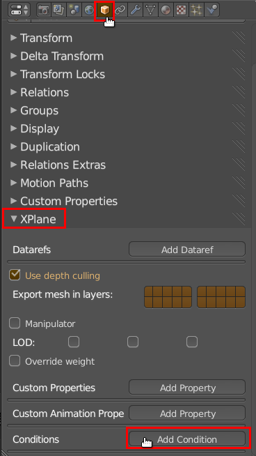

Conditions within OBJ files are supported since X-Plane 10 only. However OBJ files containing conditions also work in X-Plane 9 but simply get ignored.

X-Plane 10 supports the conditionalization of OBJ files.
Conditionalization is a process whereby the contents of a file are skipped or used depending on rendering settings.
Typical uses of conditionalization are to change the appearance of an object when shadows are enabled, or when HDR is on.

To make use of conditions in XPlane2Blender do the following:

1. In the Scene tab under XPlane set the X-Plane version to at least 10.0x 
  

2. **To conditionally hide/show an object:** Select an object and within the Object tab under XPlane click on **"Add Condition"**. 
   
   
  **To conditionally hide/show all object with a material:** Select an object and within the Material tab under XPlane click on **"Add Condition"**.
3. Now select a condition from the dropdown and choose if this condition should be true or not.
    The object(s) will be only visible if the condition is met.

If you think this is a good thing [buy me a beer](../../Donations).