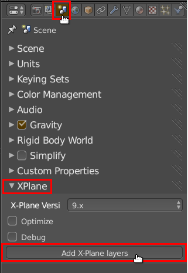
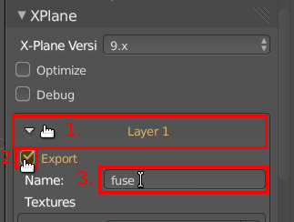
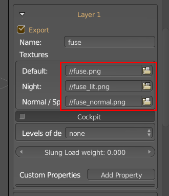
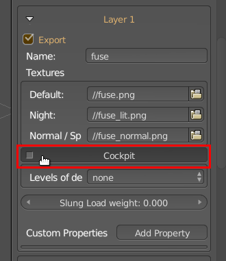
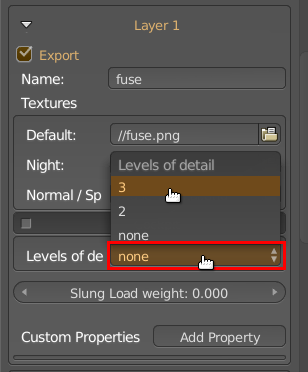
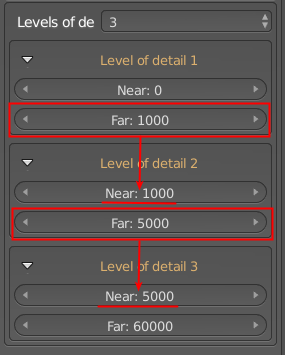
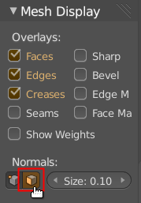
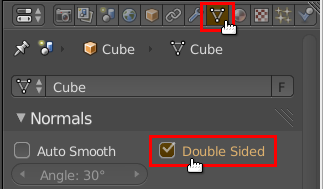
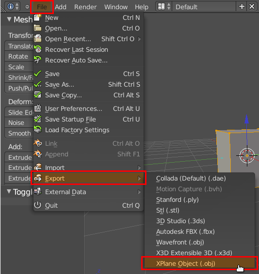
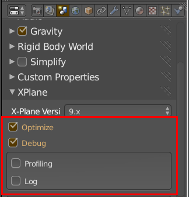

## Please learn Blender first
If you read up to this point and never used Blender 2.6x before, please first [learn some on Blender basics](http://www.blender.org/support/).

## Recommendation: Understand the OBJ file format
I also recommend you to [learn the concept of OBJ files](http://developer.x-plane.com/?article=obj8-file-format-specification). They are simple text files, you can investigate in any text-editor. Understanding the file format will help you in debugging your OBJ-Files and understanding XPlane2Blender better.

## Steps to export an OBJ file
XPlane2Blender 3.2 uses Blenders layers for export of OBJ-files. Each layer represents one OBJ file. This way you can easily export multiple OBJ files at once and organize your OBJ files.

### 1. Activate X-Plane Layers

However to make the export work we need to initiate the Blender layers to make them work as OBJ-files.
For this go to the _Scene_ Tab in the _Properties_ window.
Now scroll down until you see a _XPlane_ panel. Open it up, if it is not already. Hit the button _Add X-Plane layers_.

### 2. Configure a X-Plane layer

Now you have one subpanel for each Blender layer. Open up the first one labeled _Layer 1_.

If not enabled, check _Export_ to make the layer exportable.
Within the _Name_ field type in the **name of the OBJ file** this layer should create, without the .obj extension.
You can enter a relative path here.

In the _Textures_ group you can select the texture files the OBJ should use. One OBJ file can only use one texture file.

- The "Default" texture is the day texture,
- the "Night" texture will be used as the lit/night texture and emits light depending on the texture brightness,
- the "Normal/Specular" texture will be used for tangent space normal maps where the alpha channel defines the specular intensity.

If the OBJ file is the **cockpit Object**, check _Cockpit_.

### 3. Advanced X-Plane layer configuration

If the OBJ will be attached to the aircraft as a slung load you can set it's weight in pounds using the _Slung load weight_ slider.

If the OBJ will have levels of detail select how many in the _Levels of detail_ dropdown.

Each level of detail (= **LOD**) has a near and far clipping distance. The LOD will only be visible within these distances.
When dealing with multiple LODs be sure to set the Near clipping distance of the higher LOD to the Far distance of the preceding LOD as shown in the next image.

This will make your LODs compatible with X-Plane 9, as only X-Plane 10 allows for overlapping LODs.

You can add additional OBJ-Header Properties by hitting the _Add Property_ button.

### 4. Check your Materials

XPlane2Blender will not export objects without a material.
So check if the objects within that layer all have a material assigned.

### 5. Check your normals

By default all objects exported to X-Plane are rendered with "single-sided" faces.
This means that only the front side of a face will be visible.
If the face is facing backwards it will simply be hidden.
To be sure all faces point to the correct side you have to make the face normals of each object point outwards.

You can view the face normals of an object when in _Edit-Mode_.
In the _View Properties_ (hit N while hovering over the viewport) under _Mesh Display_ activate the the display of face normals as lines.

If the lines are to short increase the _Size_ next to this button.

The other option is to make all faces of an object "double-sided".
This can be done in the mesh tab in the properties window.

However this is not recommended as it means a performance loss in the game and possibly wrong lighting of faces pointing backwards.

### 6. Check your UVs

Objects without a UV-Layer will get no texture.
Be sure to [UV unwrap](http://wiki.blender.org/index.php/Doc:2.6/Manual/Textures/Mapping/UV/Unwrapping) all your objects before you export.
XPlane2Blender ignores material textures.
It will only apply the texture to the OBJ file, you've chosen in the _Scene > XPlane_ panel for the specifique layer.

### 7. Export

To finally export go to _File > Export > XPlane Object (.obj)_ and choose the directory you want to export all active and exportable layers to.
Remember, that you can enter relative paths into the XPlane-Layer Name field.
You can use that to also export the cockpit OBJ together with all other OBJs by exporting it to your airplanes _objects_ folder, but setting the _Name_ of the cockpit Layer to _../my_aircract_cockpit_.

## Optimize/Debug

In the properties window under the _Scene_ tab in the _XPlane_ panel you can find two options you can enable: Optimize and Debug.

**_Optimize_** will reduce the size of your OBJ files by removing duplicate vertices, however this can take up to several minutes depending on the total number of vertices your objects have.

When enabling **_Debug_** it will write debugging information like Material and Object names right into the OBJ file and print out a lot of additional information in the console.

You can then also enable **_Profiling_** which will create a time log about the export process (how long what took).
This is actually more a feature used in development of XPlane2Blender.

Enabling **_Log_** will create a log file containing all debugging information within the directory of the .blend file.
Enable this if you have trouble exporting, or things like animations do not show up in the simulator.

Also send these log files together with your bug reports.

If you think this is a good thing [buy me a beer](../../Donations).