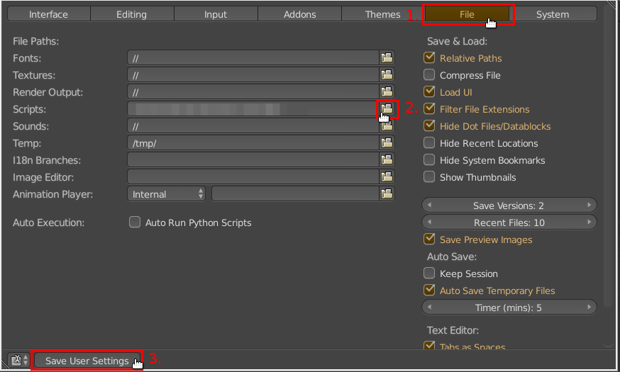
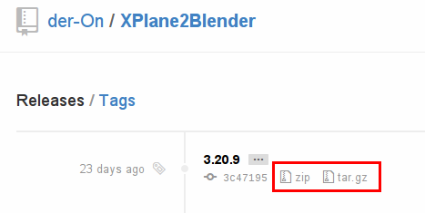
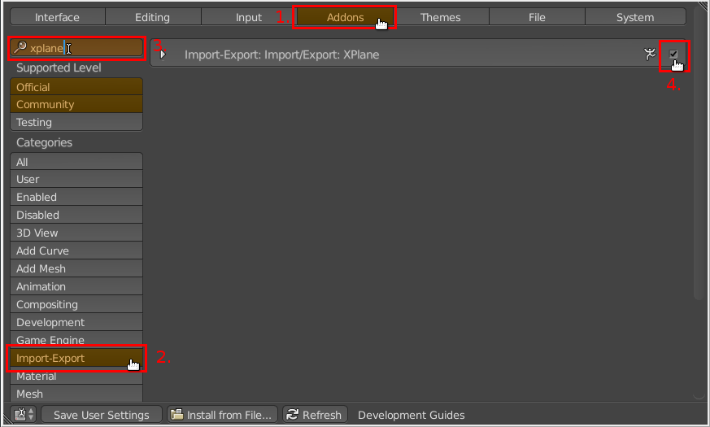

## Install Blender

1. [Download Blender](http://www.blender.org/download) for your system.
2. Install Blender
3. (Optional) Download and Install [Python 3.x](http://python.org/download/). On some Systems Blender comes with a bundled Python and thus Python does not need to be installed one your system. You can see this in the system console when Blender starts. If Python is bundled it will write something like "Found bundled Python ...".

## Setup blenders external scripts directory

1. Somewhere on your harddrive create a **_blender-scripts_** directory. Within that directory create an **"addons"** folder.
2. Open Blender and open up the File-Preferences Dialog by going to _File > User Preferences_.
    
3. Select the _File_ tab and hit the button next to the _Scripts_ input field and locate the _blender_scripts_ directory and hit _Save User Settings_.
    
4. Close blender.

Blender will now look for additional addons/scripts within your _blender-scripts_ directory.

## Install XPlane2Blender

1. Download the latest version of XPlane2Blender 3.2x [here](https://github.com/der-On/XPlane2Blender/releases) by selecting one of the listed downloads clicking the _zip_ or _tar.gz_ icons.
        
2. Extract the contents of the archive somewhere on your computer. You will get a folder named something like _XPlane2Blender-3.20.x_. Within this folder navigate to **blender_25/** and copy/move the folder **io_xplane2blender** into your **blender-scripts/addons** folder. (Afterwards you can safely delete the left behind folders, they are meant for developers.)
        ```
        XPlane2Blender-3.20.x
            > blender_25
                > io_xplane2blender
        ```
3. Open Blender and open up the User-Preferences Dialog by going to _File > User Preferences_.
        
4. Go to the **Addons** tab select **Import-Export** as Category and start typing _XPlane_ into the search box in the top left.
        The addon _Import-Export: XPlane_ should appear.
        Now Hit the checkbox next to it, to activate it. (Sometimes you must hit it twice to work).
        Finally save this configuration by cliking on _Save User Settings_. XPlane2Blender is now permanently activated in your Blender.
        


If you think this is a good thing [buy me a beer](../../Donations).