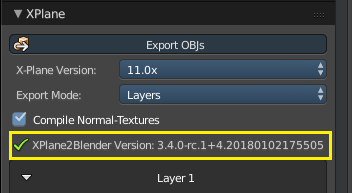
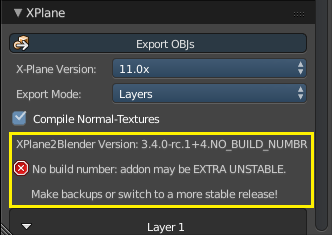
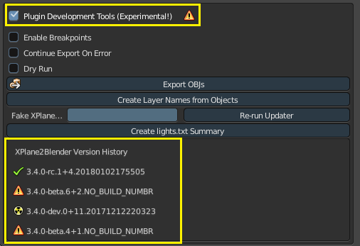

# XPlane2Blender Version Numbers

XPlane2Blender follows a fairly standard software development cycle and uses version numbers to keep track of it's progress and as metadata in .blend and .obj files to help debug problems. A fully history of every version number that a .blend file has been opened with is also kept (with restrictions).

## What Version Do I Choose?
Use the [**latest full release candidate from github**](https://github.com/der-On/XPlane2Blender/releases) for the safest and most stable experience possible. Download the .zip file that starts with "io_xplane2blender" (not Source code.zip!) and read the [installation instructions](34_installation.md).

## What Version Do I Have?
The most complete place to check what version you have is at the top of the scene settings. It should look like this:

Broken down, its part's represent:

    "3.4.0" - Major, minor, and revision number (part of any Blender Addon)
    "rc" - The build type (see below)
    "1" - What number release candidate this is

After the "+":

    "4" - The data model version
    "20180102175505" - When this build of the plugin was created (in the UTC timezone)

**Using a build, even the latest release candidate, without a build number is dangerous!** It means any number of untracked changes could be infecting your .blend file with no dialog or record of changes! Using a build without a build number will receive a large warning and no green checkmark for release candidates.

### Build Types
New features and fixes are added over the course of a development cycle. A cycle is broken into segments explained in this table (organized from safest to least safe).

Build Type|Icon|State Of Addon|Dangers|Notes
----------|----|--------------|-------|-----
Release Candidate||Contains all tested work from the beta: the most tested, stable, and documented. Rarely are new changes introduced here|As is code's nature; bugs could still exist| "Full Release" and "RC" are synonyms. There can be multiple RCs because our work is never done!
Beta||New features and fixes are being polished, tested, and integrated together|Bugs, new and old, can corrupt data|Make backups! You may have to redo or discard work. Follow development closely and communicate with us! Your **voluntary** participation is a huge help to XPlane2Blender!
Developer||Code is at its most malleable and unstable|Everything and anything could happen!|Only developers and users they're **directly** communicating with should use a dev build!

### What Versions Has This .blend File Been Opened With?
By enabling the Plugin Development section in the bottom of the scene settings, you can see a history of every version of XPlane2Blender this .blend file has been used with (things get less accurate if you open a .blend file in pre-3.4.0-beta.5 versions). This is a read only list, shown in chronological order, developed to debug automatic updater problems. It is only updated when there is a difference (excluding the build number) between last and current version numbers.

## What About Checking Out Code Directly From git?
This is **ABSOLUTELY NOT RECOMMENDED!** You will never have build numbers (unless you make a build yourself) and severely increase the chance of corrupting your work. If you feel the need to checkout code from git, **talk to us first** and we'll work it out your needs together!
