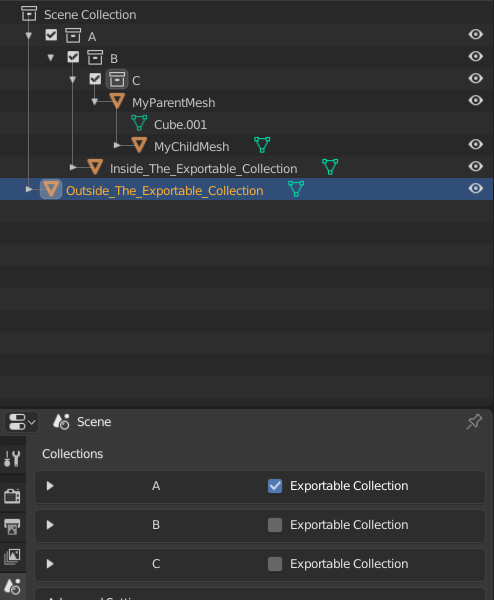
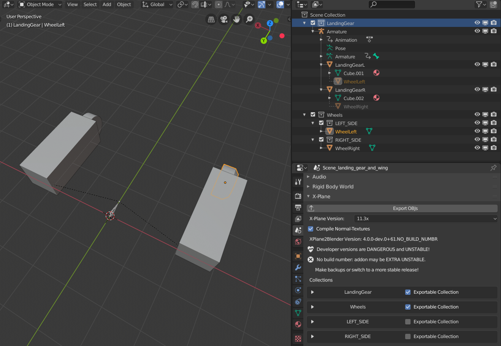
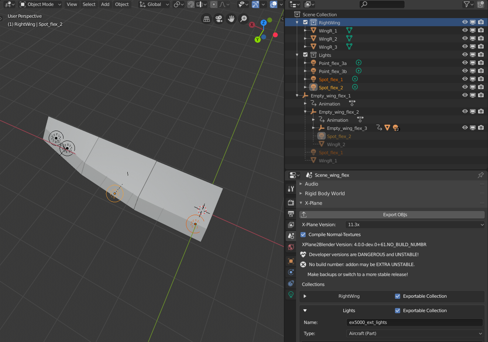
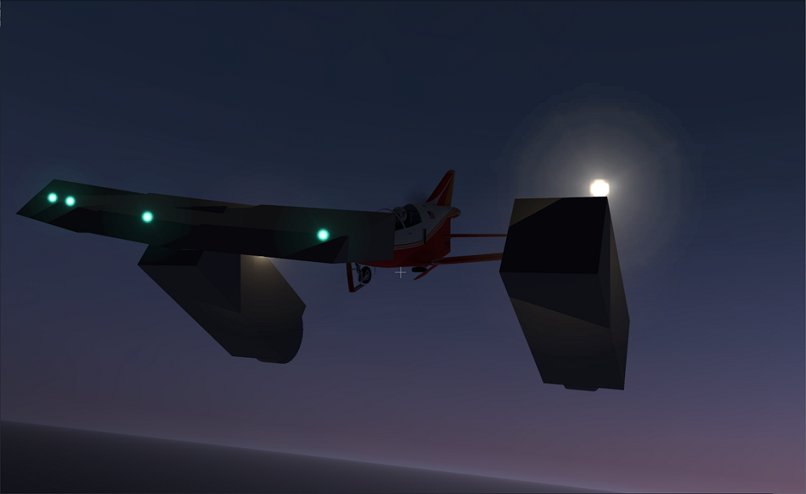

# Split Animations

If you haven't read how Collections in 2.80 work, please read [this](https://github.com/X-Plane/XPlane2Blender/releases/v4.0.0-alpha.3).

Split Animations allows you to share animations that are outside the current exportable collection. **Its purpose is to reduce the manual labor of keeping these shared animations in sync.** Some examples uses of this feature include

1. Synchronizing the motion of a landing gear and wheel in separate OBJs
2. Synchronizing the movement of complex wings flex and their lights
3. Synchronizing the movement of the cockpit OBJ's door handle manipulator and a door OBJ's door mesh
4. Having groups of manipulators follow the animation of a parent element of the cockpit
5. Many useful cases I'm sure no one else has dreamed of yet!

Lets see an example of 1 and 2 for the plane "Example5000"! You can download the files used [here](./content/split_animations_example.zip).

# An Terminology Note
Datablock Objects (Meshes, Lights, Armatures, Empties) can have 1 Object parent and many Object children. Collections can have 1 Collection parent and many Collection children. This means a datablock objects can **have** 1 parent and **be in** multiple collections. When an object **is linked** to a collection, it is in that collection and all that collection's chain of parents.

In this example "MyParentMesh" **has** no parent and 1 child ("MyChildMesh"). Both are in **in** Collection C, but also in C's parents (B and A).
Also, in this example, A is exportable. You'll see two other meshes in the .blend file "Inside_The_Exportable_Collection" and "Outside_The_Exportable_Collection". **Understanding what collections an object is in or out of is the key to this feature.**

## Landing Gear an Wheel

Our two OBJs for the landing gear scene will be `ex5000_landing_gears.obj` and `ex5000_wheels.obj`. We made two exportable collections: `Landing Gear` and `Wheels` and give them specific filenames in their OBJ settings in the Scene Properties tab. The collections WHEEL_L and WHEEL_R aren't exportable collections (see how those boxes aren't checked in the Scene Properties Tab?) I'm using these non-exporting collections for how I want to organize my project. That's all. Next I'll make the meshes and armature.  I'll also animate the Armature bone.

**Our last step is what activates this feature: We set our WheelLeft and WheelRight meshes' parents to the meshes LandingGearL and LandingGearR without changing the collection the wheels are in.** If this is tricky to accomplish by dragging and dropping in the outliner, I recommend using the wheel's Object Properties tab > Relationships > Parent, or the Ctrl+P menu.

**When the exporter finds that WheelLeft and WheelRight have a parent outside the exportable collection being exported ("Wheels"), it will follow up the chain of parents (WheelL -> LandingGearL -> Armature) collecting any animations it finds, but not any parent's meshes.** In this way the animation is shared, but no duplicate mesh is generated! Here I decided to use bone animation*, but any kind would work. 

A side effect of being able to split this into two OBJs is that you can have a separate texture for each!

*Right now only 1 bone is supported - nested bone structures will come soon.

## Wing Flex and Lights

In the Scene_wing_flex example, all the same ideas apply: `RightWing` and `Lights` are my exportable collections, given specific filenames in the scene properties. `RightWing` has all the meshes of the wing, `Lights` has all the lights in the file. To reduce the work of synchronizing the movement of each, we're going to use the split-parent feature.

Here I've animated a chain of Empties (Empty_wing_flex_1, 2, and 3) to represent the wing flexing. These empties are not in any collection. Each mesh and light is parented to one of the empties. Since the parent empties are outside the exportable collection, the animations of the empties is applied to it's children! 

## In X-Plane

As you can see in this final screenshot, the 4 OBJs attached to the BD-5J are working! Their animations are playing even though those animations came from places out of the exportable objects. Notice also how the landing gear doesn't have weird duplicate overlapping meshes! You will not get duplicate meshes with the split animation feature.

Please let me know all the use cases you come up with with this exciting new feature.
